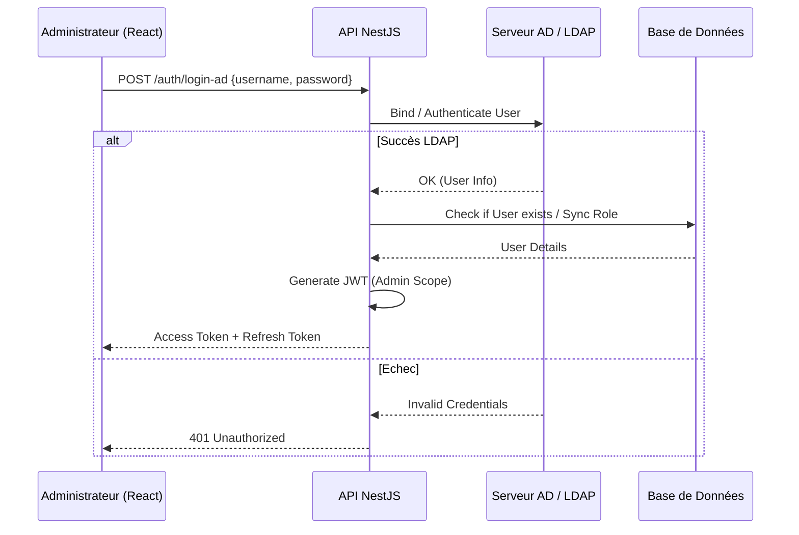
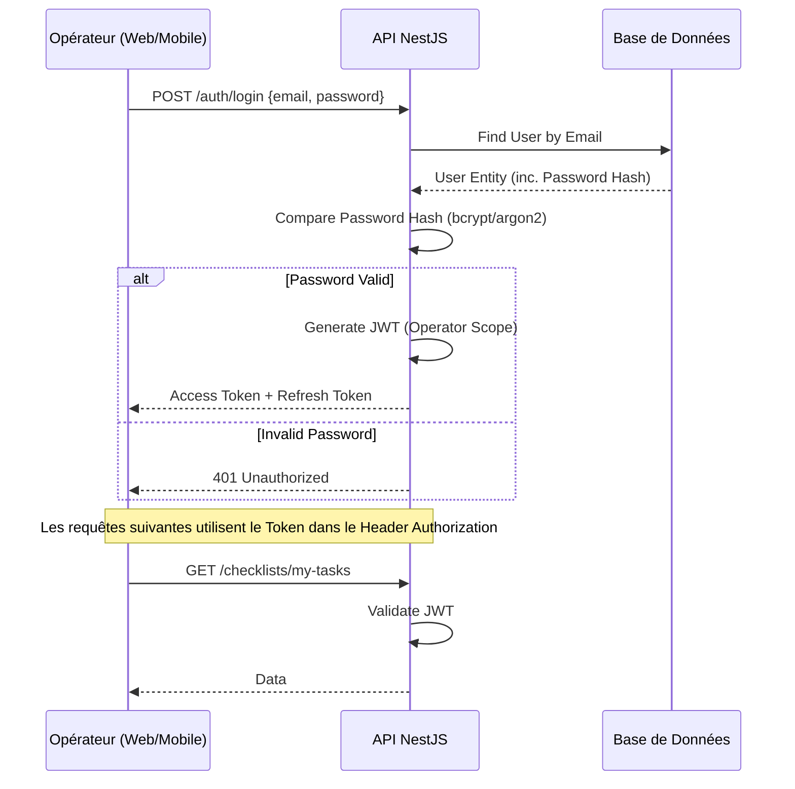

# Modélisation Complète - Plateforme de Digitalisation d'Usine

Ce document présente l'architecture technique, la modélisation des données et les diagrammes de flux pour la plateforme.

## 1. Architecture Technique Globale

L'application suit une architecture client-serveur moderne organisée en micro-services ou monolithe modulaire.

*   **Backend** : NestJS (Node.js). Fournit une API RESTful (et potentiellement GraphQL pour les données complexes).
*   **Base de Données** : PostgreSQL. Utilisation intensive du type `JSONB` pour stocker la structure dynamique des checklists et les réponses.
*   **Admin Panel** : ReactJS. Interface de gestion pour les administrateurs.
*   **Client Collecte (Web)** : ReactJS. Interface responsive pour la saisie sur le terrain.
*   **Client Collecte (Mobile)** : Flutter. Application native pour la saisie terrain (iOS/Android).

## 2. Diagrammes de Séquence d'Authentification

### 2.1 Authentification Administrateur (Active Directory)

Ce flux décrit comment un administrateur se connecte via l'annuaire d'entreprise (AD/LDAP).



### 2.2 Authentification Opérateur Terrain (JWT Standard)

Ce flux décrit la connexion classique email/mot de passe pour les opérateurs terrain sur Web et Mobile.



## 3. Modélisation des Données (ERD Simplifié)

La clé de la flexibilité réside dans l'utilisation de structures JSON pour les définitions de formulaires.

### Entités Principales

#### `User`
Table des utilisateurs (Admin et Opérateurs).
- `id`: UUID
- `email`: String (Unique)
- `password_hash`: String (Nullable si AD only)
- `full_name`: String
- `role`: Enum ['ADMIN', 'OPERATOR']
- `ad_uid`: String (Nullable, ID unique venant de l'AD)
- `is_active`: Boolean

#### `ChecklistTemplate`
Modèle de checklist défini par l'admin.
- `id`: UUID
- `title`: String
- `description`: Text
- `schema`: JSONB (La structure du formulaire: champs, types, labels, validations)
- `created_by`: UserID
- `created_at`: Timestamp

Exemple de structure `schema` :
```json
[
  {
    "id": "temp_sensor_1",
    "type": "number",
    "label": "Température Cuve A",
    "required": true,
    "min": 0,
    "max": 100
  },
  {
    "id": "visual_check",
    "type": "boolean",
    "label": "Fuite visible ?",
    "required": true
  }
]
```

#### `Assignment` (Attribution)
Liaison entre une checklist à faire et un utilisateur ou une équipe.
- `id`: UUID
- `template_id`: FK ChecklistTemplate
- `assigned_to_user_id`: FK User (Nullable si assigné à un groupe)
- `due_date`: Timestamp
- `status`: Enum ['PENDING', 'IN_PROGRESS', 'SUBMITTED', 'OVERDUE']

#### `Submission` (Soumission)
Les données récoltées.
- `id`: UUID
- `assignment_id`: FK Assignment
- `submitted_by_user_id`: FK User
- `data`: JSONB (Les réponses formatées selon le schema)
- `submitted_at`: Timestamp
- `location`: JSONB (Coords GPS optionnelles)
- `validation_status`: Enum ['PENDING', 'APPROVED', 'REJECTED']
- `reviewer_comment`: Text

## 4. Stratégie de Développement

### Backend (NestJS)
- **Modules** :
    - `AuthModule` (Strategies: LocalStrategy, AdStrategy, JwtStrategy)
    - `UsersModule`
    - `ChecklistsModule` (CRUD Templates)
    - `AssignmentsModule` (Gestion des tâches)
    - `SubmissionsModule` (Réception des données)
    - `StatsModule` (KPIs)

### Admin Frontend (React)
- Utilisation de `React-Admin` ou template custom (MUI/Tailwind).
- **Form Builder** : Composant drag-and-drop pour générer le JSON schema des checklists.

### Mobile/Web Collecte
- **Mobile (Flutter)** : Mode offline-first (stockage local des checklists et synchro quand connexion dispo).
- **Web (React)** : PWA pour capacité offline basique.
