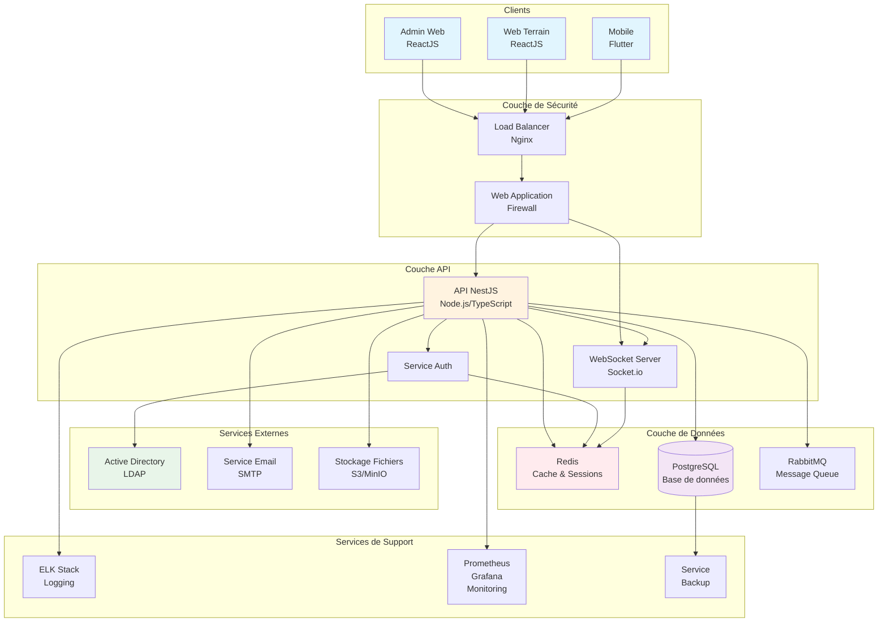
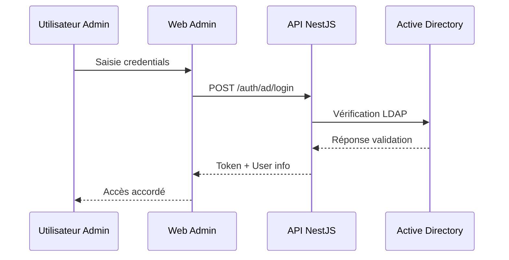
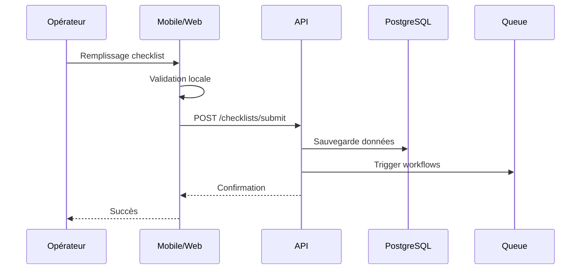
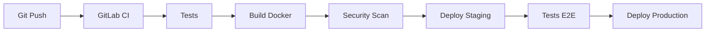

# Diagramme d'Architecture Système

## Vue d'ensemble de l'architecture



## Architecture en couches

### 1. Couche Présentation
- **Admin Web (ReactJS)**: Interface d'administration pour la gestion des tableaux de bord, KPI, et configurations
- **Web Terrain (ReactJS)**: Application web pour la collecte de données sur le terrain
- **Mobile (Flutter)**: Application mobile cross-platform pour iOS et Android

### 2. Couche Sécurité
- **Load Balancer (Nginx)**: Distribution du trafic et SSL termination
- **WAF**: Protection contre les attaques web communes
- **Rate Limiting**: Protection contre les attaques par déni de service

### 3. Couche Logique Métier
- **API NestJS**: 
  - Architecture modulaire
  - Validation automatique des données
  - Intercepteurs pour logging et transformation
  - Guards pour l'authentification et autorisation
  - Pipes pour la validation et transformation
  
### 4. Couche Services
- **Service d'authentification**:
  - Intégration Active Directory pour l'admin
  - JWT pour web terrain et mobile
  - Gestion des sessions et refresh tokens
  
- **Service de fichiers**:
  - Upload/download de documents
  - Gestion des images et vidéos
  - Compression et optimisation

### 5. Couche Données
- **PostgreSQL**: Base de données principale relationnelle
- **Redis**: Cache et gestion des sessions
- **RabbitMQ**: File de messages pour les tâches asynchrones

## Flux de données principaux

### Flux d'authentification Admin (AD)


### Flux de collecte de données


## Composants techniques détaillés

### API NestJS - Modules principaux

```typescript
// Structure modulaire de l'API
modules/
├── auth/           # Authentification AD & JWT
├── users/          # Gestion des utilisateurs
├── checklists/     # Gestion des checklists
├── data-collection/# Collecte de données
├── dashboard/      # Tableaux de bord et KPI
├── approval/       # Workflows d'approbation
├── reports/        # Génération de rapports
├── notifications/  # Système de notifications
├── files/          # Gestion des fichiers
└── common/         # Services partagés
```

### Patterns architecturaux utilisés

1. **Repository Pattern**: Abstraction de la couche de données
2. **Service Layer Pattern**: Logique métier isolée
3. **DTO Pattern**: Validation et transformation des données
4. **Factory Pattern**: Création d'objets complexes
5. **Observer Pattern**: Système d'événements
6. **Strategy Pattern**: Gestion des différents types d'auth

## Scalabilité et Performance

### Stratégies de mise à l'échelle

1. **Horizontal Scaling**:
   - Multiples instances de l'API derrière le load balancer
   - Réplication en lecture pour PostgreSQL
   - Cluster Redis pour la haute disponibilité

2. **Caching Strategy**:
   - Cache L1: In-memory dans l'application
   - Cache L2: Redis pour les données partagées
   - CDN pour les assets statiques

3. **Async Processing**:
   - RabbitMQ pour les tâches longues
   - Workers séparés pour le traitement
   - Batch processing pour les rapports

## Sécurité

### Mesures de sécurité implémentées

1. **Authentification & Autorisation**:
   - Active Directory pour les admins
   - JWT avec refresh tokens
   - RBAC (Role-Based Access Control)
   - MFA optionnel

2. **Protection des données**:
   - Chiffrement en transit (TLS 1.3)
   - Chiffrement au repos (AES-256)
   - Sanitization des inputs
   - Protection CSRF

3. **Monitoring & Audit**:
   - Logs centralisés (ELK Stack)
   - Audit trail complet
   - Alertes temps réel
   - Détection d'anomalies

## Déploiement

### Environnements

1. **Développement**: Docker Compose local
2. **Test/Staging**: Kubernetes cluster
3. **Production**: Kubernetes avec auto-scaling

### CI/CD Pipeline



## Monitoring et Observabilité

### Stack de monitoring

- **Métriques**: Prometheus + Grafana
- **Logs**: Elasticsearch + Logstash + Kibana
- **APM**: Application Performance Monitoring
- **Alerting**: AlertManager + PagerDuty

### Métriques clés (KPI techniques)

- Temps de réponse API (< 200ms p95)
- Taux d'erreur (< 0.1%)
- Disponibilité (> 99.9%)
- Utilisation CPU/RAM
- Latence base de données
- Taux de cache hit