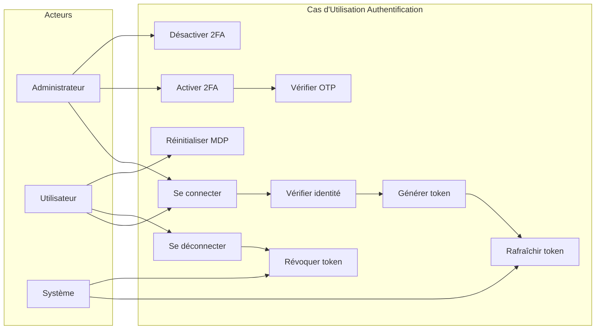
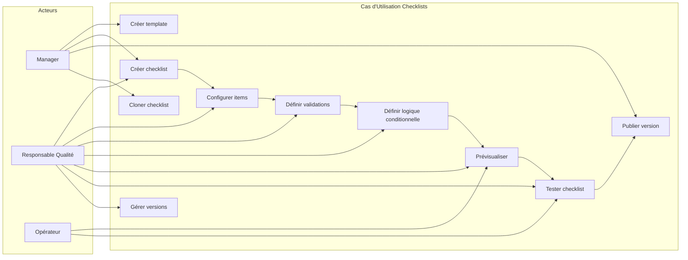
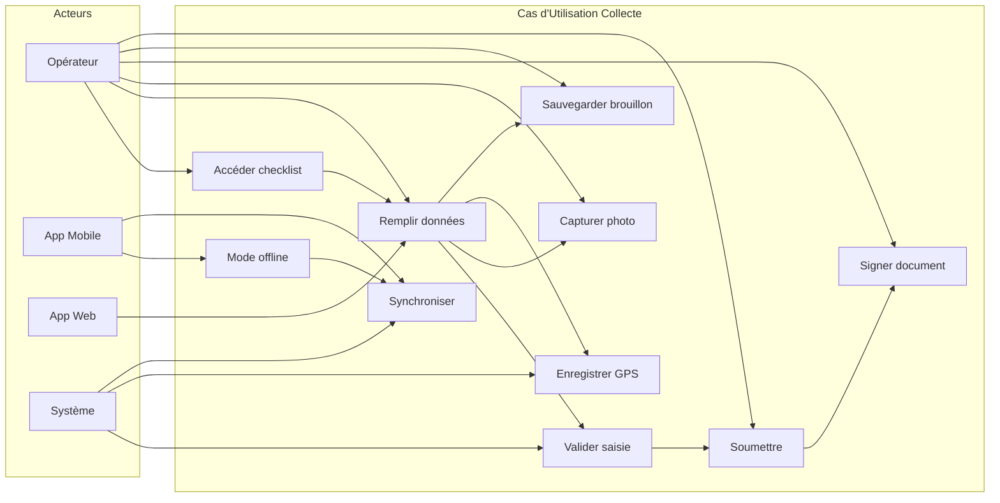
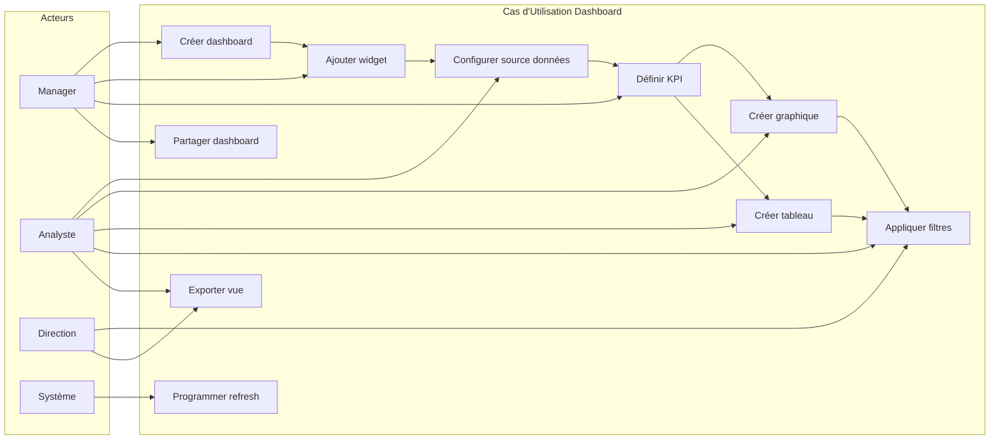
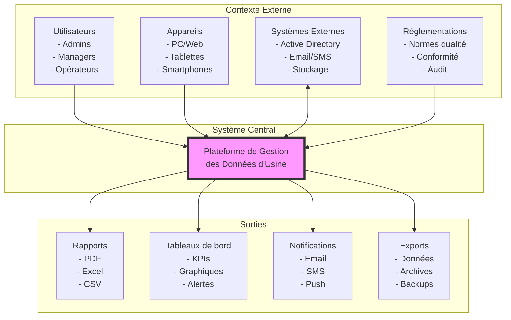
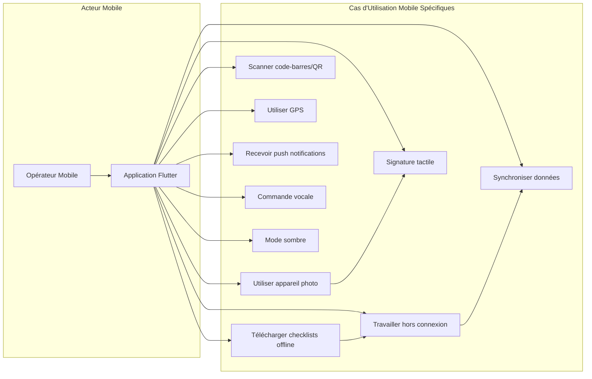

# Diagramme de Cas d'Utilisation

## Vue d'ensemble
Ce diagramme présente les différents acteurs du système et leurs cas d'utilisation principaux.

## Diagramme de cas d'utilisation global

```mermaid
graph TB
    subgraph "Acteurs Externes"
        AD[Active Directory]
        SMTP[Serveur Email]
        SMS[Service SMS]
        S3[Stockage S3]
    end

    subgraph "Acteurs Humains"
        Admin[Administrateur Système]
        Manager[Manager/Superviseur]
        Operator[Opérateur Terrain]
        Viewer[Visualisateur]
        Guest[Invité]
    end

    subgraph "Système de Gestion des Données d'Usine"
        subgraph "Authentification et Autorisation"
            UC1[Se connecter via AD]
            UC2[Se connecter via JWT]
            UC3[Gérer les sessions]
            UC4[Réinitialiser mot de passe]
            UC5[Activer 2FA]
        end

        subgraph "Gestion des Utilisateurs"
            UC10[Créer utilisateur]
            UC11[Modifier profil]
            UC12[Gérer les rôles]
            UC13[Gérer les permissions]
            UC14[Désactiver compte]
        end

        subgraph "Gestion des Checklists"
            UC20[Créer checklist]
            UC21[Modifier checklist]
            UC22[Dupliquer checklist]
            UC23[Publier checklist]
            UC24[Archiver checklist]
            UC25[Importer/Exporter]
        end

        subgraph "Attribution et Planification"
            UC30[Attribuer checklist]
            UC31[Planifier récurrence]
            UC32[Modifier attribution]
            UC33[Annuler attribution]
            UC34[Envoyer rappels]
        end

        subgraph "Collecte de Données"
            UC40[Remplir checklist]
            UC41[Sauvegarder brouillon]
            UC42[Ajouter photos]
            UC43[Signer électroniquement]
            UC44[Géolocaliser]
            UC45[Mode hors ligne]
        end

        subgraph "Workflow d'Approbation"
            UC50[Soumettre pour approbation]
            UC51[Approuver soumission]
            UC52[Rejeter soumission]
            UC53[Demander clarification]
            UC54[Escalader approbation]
        end

        subgraph "Tableaux de Bord et Rapports"
            UC60[Voir dashboard]
            UC61[Créer widgets]
            UC62[Configurer KPIs]
            UC63[Générer rapports]
            UC64[Exporter données]
            UC65[Programmer rapports]
        end

        subgraph "Administration Système"
            UC70[Configurer système]
            UC71[Gérer départements]
            UC72[Voir logs d'audit]
            UC73[Gérer intégrations]
            UC74[Sauvegarder données]
        end

        subgraph "Notifications"
            UC80[Recevoir notifications]
            UC81[Configurer alertes]
            UC82[Gérer préférences]
        end
    end

    %% Relations Admin
    Admin --> UC1
    Admin --> UC10
    Admin --> UC11
    Admin --> UC12
    Admin --> UC13
    Admin --> UC14
    Admin --> UC70
    Admin --> UC71
    Admin --> UC72
    Admin --> UC73
    Admin --> UC74

    %% Relations Manager
    Manager --> UC1
    Manager --> UC20
    Manager --> UC21
    Manager --> UC22
    Manager --> UC23
    Manager --> UC24
    Manager --> UC25
    Manager --> UC30
    Manager --> UC31
    Manager --> UC32
    Manager --> UC33
    Manager --> UC51
    Manager --> UC52
    Manager --> UC53
    Manager --> UC54
    Manager --> UC60
    Manager --> UC61
    Manager --> UC62
    Manager --> UC63
    Manager --> UC64
    Manager --> UC65

    %% Relations Operator
    Operator --> UC2
    Operator --> UC4
    Operator --> UC40
    Operator --> UC41
    Operator --> UC42
    Operator --> UC43
    Operator --> UC44
    Operator --> UC45
    Operator --> UC50
    Operator --> UC80
    Operator --> UC82

    %% Relations Viewer
    Viewer --> UC2
    Viewer --> UC60
    Viewer --> UC64

    %% Relations Guest
    Guest --> UC2

    %% Relations Systèmes Externes
    UC1 --> AD
    UC34 --> SMTP
    UC34 --> SMS
    UC42 --> S3
    UC80 --> SMTP
    UC80 --> SMS

    %% Includes et Extends
    UC40 -.includes.-> UC41
    UC40 -.includes.-> UC42
    UC40 -.includes.-> UC43
    UC50 -.extends.-> UC51
    UC50 -.extends.-> UC52
    UC30 -.includes.-> UC34
```

## Cas d'utilisation détaillés par module

### Module Authentification

### Module Gestion des Checklists

### Module Collecte de Données

### Module Dashboard et Reporting

## Matrice des cas d'utilisation par acteur

| Acteur | Cas d'utilisation principaux | Fréquence | Criticité |
|--------|------------------------------|-----------|-----------|
| **Administrateur** | Gérer utilisateurs, Configurer système, Voir audit logs | Quotidien | Haute |
| **Manager** | Créer checklists, Attribuer tâches, Approuver soumissions, Voir dashboards | Quotidien | Haute |
| **Opérateur** | Remplir checklists, Soumettre données, Consulter planning | Multiple/jour | Critique |
| **Responsable Qualité** | Définir standards, Valider processus, Analyser conformité | Hebdomadaire | Haute |
| **Analyste** | Créer rapports, Analyser tendances, Exporter données | Quotidien | Moyenne |
| **Direction** | Consulter KPIs, Voir dashboards exécutifs, Recevoir alertes | Hebdomadaire | Moyenne |
| **Invité** | Voir dashboards publics, Consulter rapports partagés | Occasionnel | Basse |

## Cas d'utilisation critiques avec préconditions et postconditions

### UC40: Remplir checklist

**Acteur principal**: Opérateur

**Préconditions**:
- L'opérateur est authentifié
- Une checklist est assignée à l'opérateur
- La checklist est dans la période de validité

**Scénario principal**:
1. L'opérateur accède à sa liste de tâches
2. L'opérateur sélectionne une checklist assignée
3. Le système affiche le formulaire de la checklist
4. L'opérateur remplit chaque champ requis
5. L'opérateur peut ajouter des photos si nécessaire
6. Le système valide les données en temps réel
7. L'opérateur signe électroniquement
8. L'opérateur soumet la checklist
9. Le système confirme la soumission

**Postconditions**:
- Les données sont sauvegardées en base
- Un workflow d'approbation est déclenché si nécessaire
- L'opérateur reçoit une confirmation
- Les KPIs sont mis à jour

**Scénarios alternatifs**:
- 4a. Mode hors ligne activé
  - Les données sont stockées localement
  - Synchronisation lors de la reconnexion
- 6a. Validation échouée
  - Message d'erreur affiché
  - Retour à l'étape 4

### UC51: Approuver soumission

**Acteur principal**: Manager/Superviseur

**Préconditions**:
- Le manager a les permissions d'approbation
- Une soumission est en attente d'approbation
- Le manager est dans la chaîne d'approbation

**Scénario principal**:
1. Le manager reçoit une notification d'approbation
2. Le manager accède à la soumission
3. Le manager examine les données soumises
4. Le manager peut consulter l'historique
5. Le manager peut demander des clarifications
6. Le manager approuve la soumission
7. Le système enregistre l'approbation
8. Le système notifie les parties concernées

**Postconditions**:
- Le statut de la soumission est mis à jour
- L'audit log est créé
- Les notifications sont envoyées
- Le workflow continue ou se termine

## Diagramme de contexte système

## Cas d'utilisation pour l'intégration mobile

## Priorisation des cas d'utilisation (MoSCoW)

### Must Have (Obligatoire)
- Se connecter (AD & JWT)
- Gérer utilisateurs et permissions
- Créer et publier checklists
- Attribuer checklists
- Remplir et soumettre checklists
- Workflow d'approbation basique
- Dashboard simple avec KPIs essentiels
- Notifications email

### Should Have (Important)
- Mode hors ligne
- Signature électronique
- Capture photo/vidéo
- Rapports personnalisés
- Planification récurrente
- Audit trail complet
- Export données

### Could Have (Souhaitable)
- Intégration calendrier
- Commande vocale
- Analytics avancés
- Prédictions IA
- Chatbot support
- API publique

### Won't Have (Exclu pour cette version)
- Intégration ERP complète
- Module de maintenance prédictive
- Réalité augmentée
- Blockchain pour traçabilité