# Diagramme de Base de Données

## Vue d'ensemble
Architecture de base de données PostgreSQL pour la plateforme de gestion des données d'usine.

## Diagramme Entité-Relation Principal

```mermaid
erDiagram
    users {
        uuid id PK
        varchar email UK
        varchar phone UK
        varchar password_hash
        varchar first_name
        varchar last_name
        varchar ad_username UK
        enum auth_type
        enum status
        uuid department_id FK
        timestamp created_at
        timestamp updated_at
        timestamp last_login
        jsonb metadata
    }

    departments {
        uuid id PK
        varchar name
        varchar code UK
        text description
        uuid parent_id FK
        boolean is_active
        timestamp created_at
        timestamp updated_at
    }

    roles {
        uuid id PK
        varchar name UK
        text description
        boolean is_system
        timestamp created_at
        timestamp updated_at
    }

    permissions {
        uuid id PK
        varchar resource
        varchar action
        text description
        timestamp created_at
    }

    user_roles {
        uuid user_id FK
        uuid role_id FK
        timestamp assigned_at
        uuid assigned_by FK
    }

    role_permissions {
        uuid role_id FK
        uuid permission_id FK
        timestamp created_at
    }

    checklists {
        uuid id PK
        varchar title
        text description
        enum type
        varchar version
        jsonb schema
        enum status
        uuid template_id FK
        uuid created_by FK
        timestamp created_at
        timestamp updated_at
        timestamp published_at
        jsonb metadata
    }

    checklist_templates {
        uuid id PK
        varchar name
        varchar category
        jsonb structure
        boolean is_active
        varchar version
        uuid created_by FK
        timestamp created_at
        timestamp updated_at
    }

    checklist_items {
        uuid id PK
        uuid checklist_id FK
        varchar label
        enum item_type
        jsonb options
        boolean is_required
        integer order_index
        jsonb validation_rules
        jsonb conditional_logic
        timestamp created_at
        timestamp updated_at
    }

    checklist_assignments {
        uuid id PK
        uuid checklist_id FK
        uuid assigned_to FK
        uuid assigned_by FK
        timestamp assigned_at
        timestamp due_date
        enum priority
        enum status
        text notes
        jsonb recurrence_pattern
        timestamp completed_at
    }

    checklist_submissions {
        uuid id PK
        uuid assignment_id FK
        uuid submitted_by FK
        jsonb data
        enum status
        timestamp started_at
        timestamp submitted_at
        varchar signature_url
        point geo_location
        varchar device_id
        jsonb metadata
    }

    data_points {
        uuid id PK
        uuid submission_id FK
        uuid item_id FK
        text value
        enum data_type
        timestamp timestamp
        jsonb metadata
        boolean is_valid
    }

    approval_workflows {
        uuid id PK
        varchar name
        enum workflow_type
        jsonb stages
        boolean is_active
        uuid created_by FK
        timestamp created_at
        timestamp updated_at
    }

    approval_requests {
        uuid id PK
        uuid workflow_id FK
        uuid submission_id FK
        uuid current_approver FK
        enum status
        text comments
        timestamp requested_at
        timestamp decided_at
        integer current_stage
        jsonb history
    }

    attachments {
        uuid id PK
        uuid entity_id
        enum entity_type
        varchar file_name
        varchar mime_type
        bigint file_size
        varchar storage_url
        varchar thumbnail_url
        timestamp uploaded_at
        uuid uploaded_by FK
        jsonb metadata
    }

    notifications {
        uuid id PK
        uuid user_id FK
        enum notification_type
        varchar title
        text message
        jsonb data
        boolean is_read
        timestamp created_at
        timestamp read_at
        timestamp expires_at
    }

    audit_logs {
        uuid id PK
        uuid user_id FK
        varchar action
        varchar entity_type
        uuid entity_id
        jsonb old_value
        jsonb new_value
        inet ip_address
        varchar user_agent
        timestamp timestamp
    }

    dashboards {
        uuid id PK
        varchar name
        uuid owner_id FK
        jsonb layout
        boolean is_public
        boolean is_default
        timestamp created_at
        timestamp updated_at
    }

    widgets {
        uuid id PK
        uuid dashboard_id FK
        enum widget_type
        varchar title
        jsonb config
        jsonb data_source
        integer position_x
        integer position_y
        integer width
        integer height
        timestamp created_at
        timestamp updated_at
    }

    kpis {
        uuid id PK
        varchar name
        text formula
        varchar unit
        decimal target_value
        decimal current_value
        enum period
        timestamp calculated_at
        jsonb thresholds
        uuid created_by FK
    }

    kpi_history {
        uuid id PK
        uuid kpi_id FK
        decimal value
        timestamp timestamp
        jsonb metadata
    }

    reports {
        uuid id PK
        varchar name
        enum report_type
        jsonb parameters
        varchar format
        uuid generated_by FK
        timestamp generated_at
        varchar storage_url
        timestamp expires_at
    }

    scheduled_tasks {
        uuid id PK
        varchar name
        varchar task_type
        jsonb config
        varchar cron_expression
        boolean is_active
        timestamp last_run
        timestamp next_run
        jsonb last_result
    }

    sessions {
        uuid id PK
        uuid user_id FK
        varchar token_hash
        varchar device_id
        varchar platform
        inet ip_address
        timestamp created_at
        timestamp expires_at
        boolean is_active
    }

    password_reset_tokens {
        uuid id PK
        uuid user_id FK
        varchar token_hash
        timestamp created_at
        timestamp expires_at
        boolean is_used
    }

    otp_codes {
        uuid id PK
        uuid user_id FK
        varchar code_hash
        enum method
        timestamp created_at
        timestamp expires_at
        integer attempts
        boolean is_used
    }

    %% Relations
    users ||--o{ user_roles : has
    roles ||--o{ user_roles : assigned_to
    roles ||--o{ role_permissions : has
    permissions ||--o{ role_permissions : granted_to
    users }o--|| departments : belongs_to
    departments ||--o{ departments : has_subdepartments
    
    users ||--o{ checklists : creates
    checklists ||--o{ checklist_items : contains
    checklists }o--|| checklist_templates : based_on
    
    checklists ||--o{ checklist_assignments : has
    users ||--o{ checklist_assignments : assigned_to
    users ||--o{ checklist_assignments : assigned_by
    
    checklist_assignments ||--o{ checklist_submissions : has
    users ||--o{ checklist_submissions : submitted_by
    checklist_submissions ||--o{ data_points : contains
    checklist_items ||--o{ data_points : related_to
    
    checklist_submissions ||--o{ approval_requests : requires
    approval_workflows ||--o{ approval_requests : follows
    users ||--o{ approval_requests : approves
    
    users ||--o{ notifications : receives
    users ||--o{ audit_logs : generates
    
    checklist_submissions ||--o{ attachments : has
    data_points ||--o{ attachments : has
    
    users ||--o{ dashboards : owns
    dashboards ||--o{ widgets : contains
    widgets }o--o{ kpis : displays
    kpis ||--o{ kpi_history : tracks
    
    users ||--o{ reports : generates
    users ||--o{ sessions : has
    users ||--o{ password_reset_tokens : requests
    users ||--o{ otp_codes : receives
```



## Tables de configuration

```sql
-- Table de configuration système
CREATE TABLE system_config (
    id UUID PRIMARY KEY DEFAULT gen_random_uuid(),
    key VARCHAR(100) UNIQUE NOT NULL,
    value JSONB NOT NULL,
    category VARCHAR(50),
    description TEXT,
    is_sensitive BOOLEAN DEFAULT FALSE,
    updated_at TIMESTAMP DEFAULT CURRENT_TIMESTAMP,
    updated_by UUID REFERENCES users(id)
);

-- Table de traductions i18n
CREATE TABLE translations (
    id UUID PRIMARY KEY DEFAULT gen_random_uuid(),
    locale VARCHAR(5) NOT NULL,
    key VARCHAR(200) NOT NULL,
    value TEXT NOT NULL,
    context VARCHAR(100),
    updated_at TIMESTAMP DEFAULT CURRENT_TIMESTAMP,
    UNIQUE(locale, key, context)
);

-- Table de files d'attente pour les jobs asynchrones
CREATE TABLE job_queue (
    id UUID PRIMARY KEY DEFAULT gen_random_uuid(),
    queue_name VARCHAR(50) NOT NULL,
    job_type VARCHAR(50) NOT NULL,
    payload JSONB NOT NULL,
    priority INTEGER DEFAULT 0,
    attempts INTEGER DEFAULT 0,
    max_attempts INTEGER DEFAULT 3,
    status VARCHAR(20) DEFAULT 'pending',
    scheduled_at TIMESTAMP,
    started_at TIMESTAMP,
    completed_at TIMESTAMP,
    failed_at TIMESTAMP,
    error_message TEXT,
    created_at TIMESTAMP DEFAULT CURRENT_TIMESTAMP
);
```

## Index pour optimisation des performances

```sql
-- Index sur les clés étrangères principales
CREATE INDEX idx_users_department ON users(department_id);
CREATE INDEX idx_user_roles_user ON user_roles(user_id);
CREATE INDEX idx_user_roles_role ON user_roles(role_id);
CREATE INDEX idx_checklist_items_checklist ON checklist_items(checklist_id);
CREATE INDEX idx_assignments_checklist ON checklist_assignments(checklist_id);
CREATE INDEX idx_assignments_user ON checklist_assignments(assigned_to);
CREATE INDEX idx_submissions_assignment ON checklist_submissions(assignment_id);
CREATE INDEX idx_data_points_submission ON data_points(submission_id);
CREATE INDEX idx_attachments_entity ON attachments(entity_id, entity_type);

-- Index pour les requêtes fréquentes
CREATE INDEX idx_users_email ON users(email);
CREATE INDEX idx_users_phone ON users(phone);
CREATE INDEX idx_checklists_status ON checklists(status);
CREATE INDEX idx_assignments_status_due ON checklist_assignments(status, due_date);
CREATE INDEX idx_submissions_status ON checklist_submissions(status);
CREATE INDEX idx_notifications_user_unread ON notifications(user_id, is_read) WHERE is_read = FALSE;
CREATE INDEX idx_audit_logs_entity ON audit_logs(entity_type, entity_id);
CREATE INDEX idx_audit_logs_user_time ON audit_logs(user_id, timestamp);

-- Index sur les champs JSONB
CREATE INDEX idx_checklists_metadata ON checklists USING GIN(metadata);
CREATE INDEX idx_submissions_data ON checklist_submissions USING GIN(data);
CREATE INDEX idx_widgets_config ON widgets USING GIN(config);

-- Index géospatial
CREATE INDEX idx_submissions_location ON checklist_submissions USING GIST(geo_location);

-- Index de texte complet
CREATE INDEX idx_checklists_search ON checklists USING GIN(
    to_tsvector('french', title || ' ' || COALESCE(description, ''))
);
```

## Triggers et fonctions

```sql
-- Fonction pour mise à jour automatique de updated_at
CREATE OR REPLACE FUNCTION update_updated_at_column()
RETURNS TRIGGER AS $$
BEGIN
    NEW.updated_at = CURRENT_TIMESTAMP;
    RETURN NEW;
END;
$$ language 'plpgsql';

-- Application du trigger sur les tables concernées
CREATE TRIGGER update_users_updated_at BEFORE UPDATE ON users
    FOR EACH ROW EXECUTE FUNCTION update_updated_at_column();
    
CREATE TRIGGER update_checklists_updated_at BEFORE UPDATE ON checklists
    FOR EACH ROW EXECUTE FUNCTION update_updated_at_column();
    
CREATE TRIGGER update_departments_updated_at BEFORE UPDATE ON departments
    FOR EACH ROW EXECUTE FUNCTION update_updated_at_column();

-- Fonction pour l'audit automatique
CREATE OR REPLACE FUNCTION audit_trigger_function()
RETURNS TRIGGER AS $$
BEGIN
    INSERT INTO audit_logs (
        user_id,
        action,
        entity_type,
        entity_id,
        old_value,
        new_value,
        timestamp
    ) VALUES (
        current_setting('app.current_user_id')::UUID,
        TG_OP,
        TG_TABLE_NAME,
        CASE 
            WHEN TG_OP = 'DELETE' THEN OLD.id
            ELSE NEW.id
        END,
        CASE WHEN TG_OP IN ('UPDATE', 'DELETE') THEN row_to_json(OLD) END,
        CASE WHEN TG_OP IN ('INSERT', 'UPDATE') THEN row_to_json(NEW) END,
        CURRENT_TIMESTAMP
    );
    RETURN NEW;
END;
$$ language 'plpgsql';

-- Fonction pour calculer les KPIs
CREATE OR REPLACE FUNCTION calculate_kpi(kpi_id UUID)
RETURNS DECIMAL AS $$
DECLARE
    kpi_record RECORD;
    result DECIMAL;
BEGIN
    SELECT * INTO kpi_record FROM kpis WHERE id = kpi_id;
    
    -- Exécution de la formule SQL stockée
    EXECUTE kpi_record.formula INTO result;
    
    -- Mise à jour de la valeur actuelle
    UPDATE kpis 
    SET current_value = result, 
        calculated_at = CURRENT_TIMESTAMP
    WHERE id = kpi_id;
    
    -- Historisation
    INSERT INTO kpi_history (kpi_id, value, timestamp)
    VALUES (kpi_id, result, CURRENT_TIMESTAMP);
    
    RETURN result;
END;
$$ language 'plpgsql';
```

## Vues matérialisées pour les performances

```sql
-- Vue matérialisée pour les statistiques des checklists
CREATE MATERIALIZED VIEW mv_checklist_stats AS
SELECT 
    c.id,
    c.title,
    c.type,
    COUNT(DISTINCT ca.id) as total_assignments,
    COUNT(DISTINCT cs.id) as total_submissions,
    COUNT(DISTINCT CASE WHEN cs.status = 'APPROVED' THEN cs.id END) as approved_submissions,
    AVG(EXTRACT(EPOCH FROM (cs.submitted_at - cs.started_at))/60) as avg_completion_time_minutes,
    MAX(cs.submitted_at) as last_submission_date
FROM checklists c
LEFT JOIN checklist_assignments ca ON c.id = ca.checklist_id
LEFT JOIN checklist_submissions cs ON ca.id = cs.assignment_id
GROUP BY c.id, c.title, c.type;

CREATE INDEX idx_mv_checklist_stats_id ON mv_checklist_stats(id);

-- Vue matérialisée pour les performances utilisateurs
CREATE MATERIALIZED VIEW mv_user_performance AS
SELECT 
    u.id,
    u.email,
    u.first_name,
    u.last_name,
    d.name as department_name,
    COUNT(DISTINCT cs.id) as total_submissions,
    COUNT(DISTINCT CASE WHEN cs.status = 'APPROVED' THEN cs.id END) as approved_submissions,
    AVG(CASE 
        WHEN ca.due_date IS NOT NULL AND cs.submitted_at <= ca.due_date THEN 1 
        ELSE 0 
    END) * 100 as on_time_rate,
    COUNT(DISTINCT DATE(cs.submitted_at)) as active_days
FROM users u
LEFT JOIN departments d ON u.department_id = d.id
LEFT JOIN checklist_submissions cs ON u.id = cs.submitted_by
LEFT JOIN checklist_assignments ca ON cs.assignment_id = ca.id
WHERE cs.submitted_at >= CURRENT_DATE - INTERVAL '30 days'
GROUP BY u.id, u.email, u.first_name, u.last_name, d.name;

CREATE INDEX idx_mv_user_performance_id ON mv_user_performance(id);

-- Rafraîchissement programmé des vues
CREATE OR REPLACE FUNCTION refresh_materialized_views()
RETURNS void AS $$
BEGIN
    REFRESH MATERIALIZED VIEW CONCURRENTLY mv_checklist_stats;
    REFRESH MATERIALIZED VIEW CONCURRENTLY mv_user_performance;
END;
$$ language 'plpgsql';
```

## Partitionnement des tables volumineuses

```sql
-- Partitionnement de la table audit_logs par mois
CREATE TABLE audit_logs_partitioned (
    LIKE audit_logs INCLUDING ALL
) PARTITION BY RANGE (timestamp);

-- Création automatique des partitions
CREATE TABLE audit_logs_y2024m01 PARTITION OF audit_logs_partitioned
    FOR VALUES FROM ('2024-01-01') TO ('2024-02-01');
CREATE TABLE audit_logs_y2024m02 PARTITION OF audit_logs_partitioned
    FOR VALUES FROM ('2024-02-01') TO ('2024-03-01');
-- ... continuer pour chaque mois

-- Partitionnement de data_points par submission_id (hash)
CREATE TABLE data_points_partitioned (
    LIKE data_points INCLUDING ALL
) PARTITION BY HASH (submission_id);

CREATE TABLE data_points_p0 PARTITION OF data_points_partitioned
    FOR VALUES WITH (MODULUS 4, REMAINDER 0);
CREATE TABLE data_points_p1 PARTITION OF data_points_partitioned
    FOR VALUES WITH (MODULUS 4, REMAINDER 1);
CREATE TABLE data_points_p2 PARTITION OF data_points_partitioned
    FOR VALUES WITH (MODULUS 4, REMAINDER 2);
CREATE TABLE data_points_p3 PARTITION OF data_points_partitioned
    FOR VALUES WITH (MODULUS 4, REMAINDER 3);
```

## Stratégie de backup et archivage

```sql
-- Table d'archivage pour les données anciennes
CREATE TABLE archived_submissions (
    LIKE checklist_submissions INCLUDING ALL,
    archived_at TIMESTAMP DEFAULT CURRENT_TIMESTAMP,
    archived_by UUID REFERENCES users(id)
);

-- Procédure d'archivage
CREATE OR REPLACE FUNCTION archive_old_submissions()
RETURNS void AS $$
BEGIN
    -- Archiver les soumissions de plus de 2 ans
    INSERT INTO archived_submissions
    SELECT *, CURRENT_TIMESTAMP, NULL
    FROM checklist_submissions
    WHERE submitted_at < CURRENT_DATE - INTERVAL '2 years';
    
    -- Supprimer les données archivées de la table principale
    DELETE FROM data_points 
    WHERE submission_id IN (
        SELECT id FROM checklist_submissions 
        WHERE submitted_at < CURRENT_DATE - INTERVAL '2 years'
    );
    
    DELETE FROM checklist_submissions
    WHERE submitted_at < CURRENT_DATE - INTERVAL '2 years';
END;
$$ language 'plpgsql';
```

## Contraintes et règles métier

```sql
-- Contraintes de validation
ALTER TABLE users 
    ADD CONSTRAINT chk_email_format 
    CHECK (email ~* '^[A-Za-z0-9._%+-]+@[A-Za-z0-9.-]+\.[A-Za-z]{2,}$');

ALTER TABLE users 
    ADD CONSTRAINT chk_phone_format 
    CHECK (phone ~ '^\+?[1-9]\d{1,14}$');

ALTER TABLE checklist_assignments
    ADD CONSTRAINT chk_due_date_future
    CHECK (due_date > assigned_at);

ALTER TABLE kpis
    ADD CONSTRAINT chk_target_positive
    CHECK (target_value >= 0);

-- Contraintes d'intégrité référentielle personnalisées
ALTER TABLE departments
    ADD CONSTRAINT chk_no_self_parent
    CHECK (id != parent_id);

-- Contraintes d'unicité composées
ALTER TABLE user_roles
    ADD CONSTRAINT uk_user_role UNIQUE (user_id, role_id);

ALTER TABLE role_permissions
    ADD CONSTRAINT uk_role_permission UNIQUE (role_id, permission_id);

ALTER TABLE checklist_items
    ADD CONSTRAINT uk_checklist_order UNIQUE (checklist_id, order_index);
```

## Configuration de la réplication et haute disponibilité

```sql
-- Configuration pour la réplication streaming
-- Sur le serveur maître
ALTER SYSTEM SET wal_level = replica;
ALTER SYSTEM SET max_wal_senders = 5;
ALTER SYSTEM SET wal_keep_segments = 64;
ALTER SYSTEM SET hot_standby = on;

-- Configuration des slots de réplication
SELECT pg_create_physical_replication_slot('replica1');
SELECT pg_create_physical_replication_slot('replica2');

-- Monitoring de la réplication
CREATE VIEW replication_status AS
SELECT 
    client_addr,
    state,
    sent_lsn,
    write_lsn,
    flush_lsn,
    replay_lsn,
    sync_state
FROM pg_stat_replication;
```

## Métriques et monitoring

```sql
-- Vue pour le monitoring des performances
CREATE VIEW database_metrics AS
SELECT 
    (SELECT count(*) FROM users WHERE last_login >= CURRENT_DATE - INTERVAL '1 day') as daily_active_users,
    (SELECT count(*) FROM checklist_submissions WHERE submitted_at >= CURRENT_DATE) as submissions_today,
    (SELECT avg(extract(epoch from (submitted_at - started_at))/60) 
     FROM checklist_submissions 
     WHERE submitted_at >= CURRENT_DATE) as avg_completion_time_today,
    (SELECT pg_database_size(current_database())) as database_size,
    (SELECT count(*) FROM pg_stat_activity WHERE state = 'active') as active_connections,
    (SELECT count(*) FROM audit_logs WHERE timestamp >= CURRENT_DATE) as audit_logs_today;
```