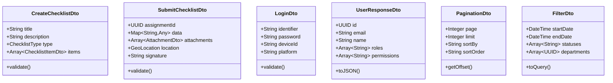

# Diagramme de Classes UML

## Vue d'ensemble
Ce diagramme représente les principales classes métier du système et leurs relations.

## Diagramme de classes principal


## Classes d'énumération

```mermaid
classDiagram
    class AuthType {
        <<enumeration>>
        JWT
        ACTIVE_DIRECTORY
    }

    class UserStatus {
        <<enumeration>>
        ACTIVE
        INACTIVE
        LOCKED
        PENDING
    }

    class ChecklistType {
        <<enumeration>>
        INSPECTION
        MAINTENANCE
        QUALITY_CONTROL
        SAFETY
        AUDIT
    }

    class ChecklistStatus {
        <<enumeration>>
        DRAFT
        PUBLISHED
        ARCHIVED
    }

    class ItemType {
        <<enumeration>>
        TEXT
        NUMBER
        DATE
        TIME
        DATETIME
        BOOLEAN
        SELECT
        MULTISELECT
        FILE
        PHOTO
        SIGNATURE
        LOCATION
    }

    class AssignmentStatus {
        <<enumeration>>
        PENDING
        IN_PROGRESS
        COMPLETED
        OVERDUE
        CANCELLED
    }

    class SubmissionStatus {
        <<enumeration>>
        DRAFT
        SUBMITTED
        IN_REVIEW
        APPROVED
        REJECTED
        ARCHIVED
    }

    class Priority {
        <<enumeration>>
        LOW
        MEDIUM
        HIGH
        CRITICAL
    }

    class ApprovalStatus {
        <<enumeration>>
        PENDING
        APPROVED
        REJECTED
        ESCALATED
        DELEGATED
    }

    class NotificationType {
        <<enumeration>>
        ASSIGNMENT
        SUBMISSION
        APPROVAL_REQUIRED
        APPROVAL_DECISION
        REMINDER
        ALERT
        SYSTEM
    }

    class WorkflowType {
        <<enumeration>>
        SEQUENTIAL
        PARALLEL
        CONDITIONAL
    }

    class DataType {
        <<enumeration>>
        STRING
        NUMBER
        BOOLEAN
        DATE
        JSON
        BINARY
    }

    class EntityType {
        <<enumeration>>
        CHECKLIST
        SUBMISSION
        DATA_POINT
        USER
        REPORT
    }

    class WidgetType {
        <<enumeration>>
        CHART
        TABLE
        KPI_CARD
        MAP
        TIMELINE
        LIST
    }

    class ReportType {
        <<enumeration>>
        SUMMARY
        DETAILED
        COMPLIANCE
        TREND
        CUSTOM
    }

    class Period {
        <<enumeration>>
        DAILY
        WEEKLY
        MONTHLY
        QUARTERLY
        YEARLY
    }
```



## Classes de service


## Patterns de conception utilisés

### 1. Repository Pattern
```typescript
interface Repository<T> {
    findById(id: UUID): Promise<T>
    findAll(filters?: any): Promise<T[]>
    create(entity: T): Promise<T>
    update(id: UUID, entity: T): Promise<T>
    delete(id: UUID): Promise<void>
}
```

### 2. Factory Pattern
```typescript
class ChecklistFactory {
    static createFromTemplate(template: ChecklistTemplate): Checklist
    static createBlank(): Checklist
    static createFromImport(data: any): Checklist
}
```

### 3. Strategy Pattern
```typescript
interface AuthenticationStrategy {
    authenticate(credentials: any): Promise<User>
    verify(token: string): Promise<boolean>
}

class ADAuthStrategy implements AuthenticationStrategy { }
class JWTAuthStrategy implements AuthenticationStrategy { }
```

### 4. Observer Pattern
```typescript
class EventEmitter {
    private listeners: Map<string, Function[]>
    
    on(event: string, handler: Function): void
    emit(event: string, data: any): void
    off(event: string, handler: Function): void
}
```

### 5. Decorator Pattern
```typescript
@Injectable()
@UseGuards(AuthGuard)
@UseInterceptors(LoggingInterceptor)
class ChecklistController {
    @Post()
    @Roles('admin', 'manager')
    create(@Body() checklist: CreateChecklistDto) { }
}
```

### 6. Chain of Responsibility Pattern
```typescript
abstract class ApprovalHandler {
    protected next: ApprovalHandler
    
    setNext(handler: ApprovalHandler): ApprovalHandler
    handle(request: ApprovalRequest): void
}

class ManagerApproval extends ApprovalHandler { }
class DirectorApproval extends ApprovalHandler { }
class CEOApproval extends ApprovalHandler { }
```

## Classes DTO (Data Transfer Objects)



## Relations avec la base de données

Les classes métier sont mappées vers des tables PostgreSQL via TypeORM :

- Utilisation de décorateurs pour le mapping (`@Entity`, `@Column`, `@ManyToOne`, etc.)
- Gestion automatique des migrations
- Support des transactions
- Lazy loading et eager loading selon les besoins
- Indexation pour les performances

## Considérations de performance

1. **Lazy Loading** : Chargement différé des relations pour éviter le N+1 problem
2. **Caching** : Utilisation de Redis pour les données fréquemment accédées
3. **Pagination** : Toutes les listes sont paginées
4. **Indexation** : Index sur les clés étrangères et les champs de recherche
5. **Query Optimization** : Utilisation de query builders pour des requêtes optimisées