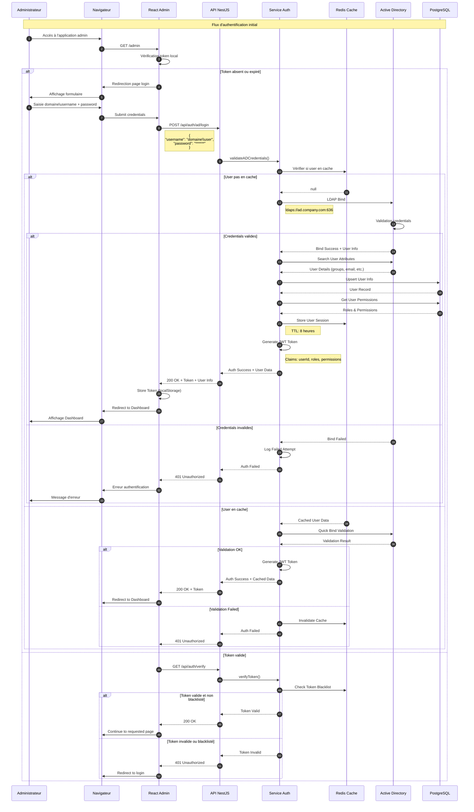
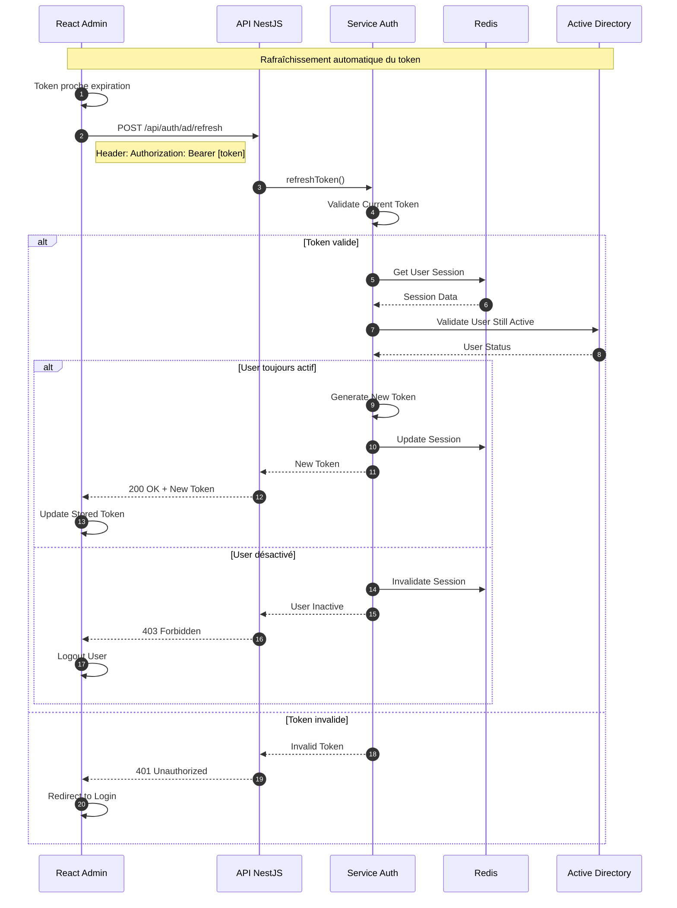
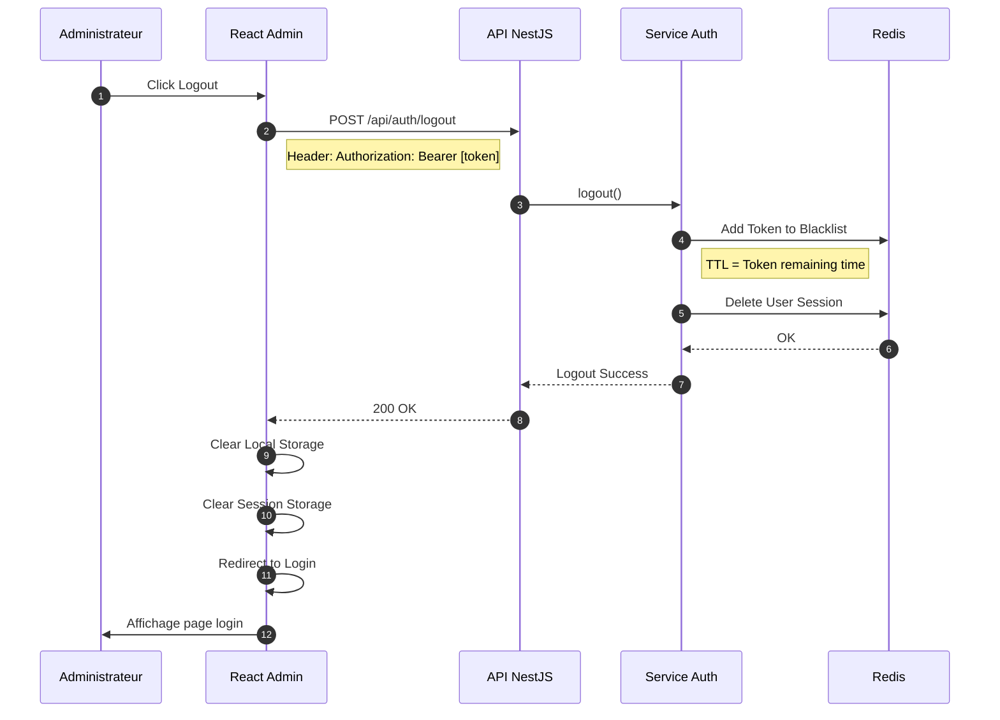
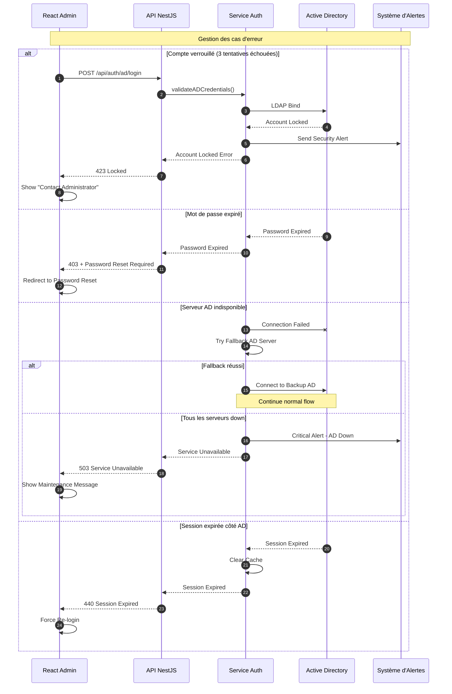

# Diagramme de Séquence - Authentification Active Directory (Admin)

## Vue d'ensemble
L'authentification via Active Directory est utilisée exclusivement pour l'interface d'administration. Elle permet une intégration avec l'infrastructure d'entreprise existante et une gestion centralisée des accès.

## Diagramme de séquence principal



## Flux de rafraîchissement du token



## Flux de déconnexion



## Gestion des erreurs et cas particuliers



## Configuration et paramètres

### Configuration LDAP

```typescript
// Configuration pour la connexion Active Directory
interface ADConfig {
  // Serveur principal
  primary: {
    url: 'ldaps://ad.company.com:636',
    baseDN: 'DC=company,DC=com',
    username: 'CN=ServiceAccount,CN=Users,DC=company,DC=com',
    password: process.env.AD_SERVICE_PASSWORD,
  },
  
  // Serveur de backup
  secondary: {
    url: 'ldaps://ad2.company.com:636',
    baseDN: 'DC=company,DC=com',
    username: 'CN=ServiceAccount,CN=Users,DC=company,DC=com',
    password: process.env.AD_SERVICE_PASSWORD,
  },
  
  // Options de connexion
  options: {
    tlsOptions: {
      rejectUnauthorized: true,
      ca: [fs.readFileSync('./certs/ca.pem')],
    },
    timeout: 5000,
    connectTimeout: 10000,
    idleTimeout: 180000,
  },
  
  // Mapping des attributs
  attributes: {
    user: ['sAMAccountName', 'mail', 'displayName', 'memberOf', 'department'],
    group: ['cn', 'member', 'description'],
  },
  
  // Filtres de recherche
  filters: {
    user: '(&(objectClass=user)(objectCategory=person)(!(userAccountControl:1.2.840.113556.1.4.803:=2)))',
    group: '(objectClass=group)',
  },
}
```

### Structure du Token JWT

```json
{
  "header": {
    "alg": "RS256",
    "typ": "JWT"
  },
  "payload": {
    "sub": "domaine\\username",
    "userId": "550e8400-e29b-41d4-a716-446655440000",
    "email": "user@company.com",
    "name": "John Doe",
    "roles": ["ADMIN", "SUPERVISOR"],
    "permissions": [
      "dashboard.view",
      "checklist.create",
      "checklist.approve",
      "user.manage"
    ],
    "department": "Production",
    "iat": 1698765432,
    "exp": 1698794232,
    "iss": "factory-platform",
    "aud": "admin-interface"
  },
  "signature": "..."
}
```

### Codes d'erreur spécifiques

| Code | Description | Action côté client |
|------|-------------|-------------------|
| 401 | Credentials invalides | Afficher erreur de connexion |
| 403 | Compte désactivé ou sans permissions | Message "Contactez l'administrateur" |
| 423 | Compte verrouillé | Message avec délai de déblocage |
| 440 | Session AD expirée | Forcer reconnexion |
| 503 | Service AD indisponible | Message de maintenance |

## Sécurité et bonnes pratiques

### Mesures de sécurité implémentées

1. **Connexion sécurisée**
   - LDAPS (LDAP over SSL) sur port 636
   - Validation du certificat SSL
   - Aucun mot de passe en clair

2. **Protection contre les attaques**
   - Rate limiting: max 5 tentatives par minute
   - Account lockout après 3 échecs
   - Captcha après 2 échecs
   - Détection des patterns d'attaque

3. **Gestion des sessions**
   - Token avec durée de vie limitée (8h)
   - Blacklist des tokens révoqués
   - Rotation automatique des tokens
   - Session binding avec IP

4. **Audit et monitoring**
   - Log de toutes les tentatives de connexion
   - Alertes sur comportements suspects
   - Audit trail complet
   - Métriques de performance

### Compliance et standards

- **OWASP Top 10** compliance
- **ISO 27001** alignement
- **GDPR** pour les données personnelles
- **PCI DSS** si traitement de données sensibles