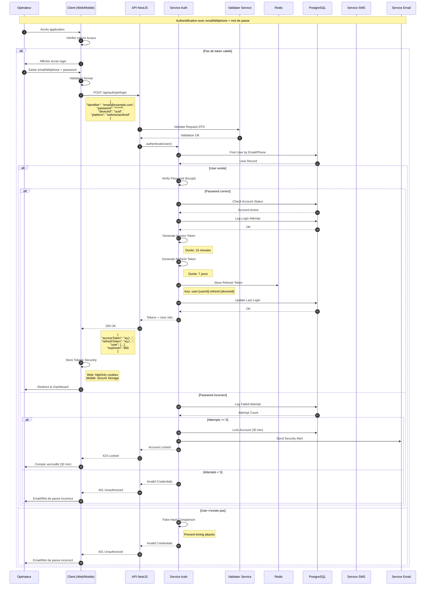
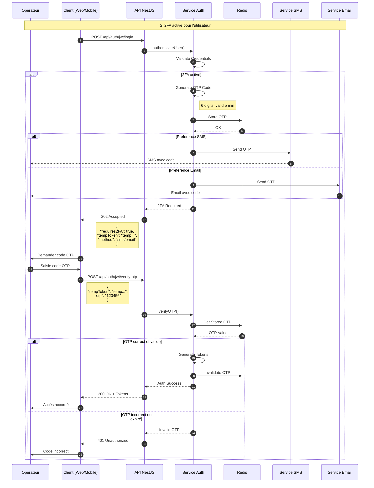
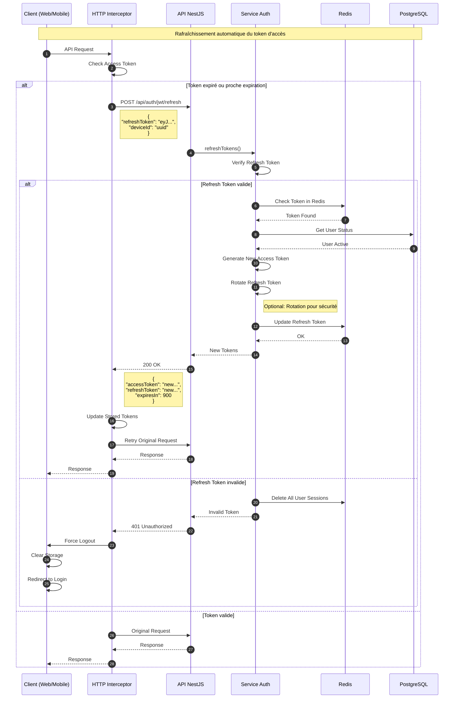
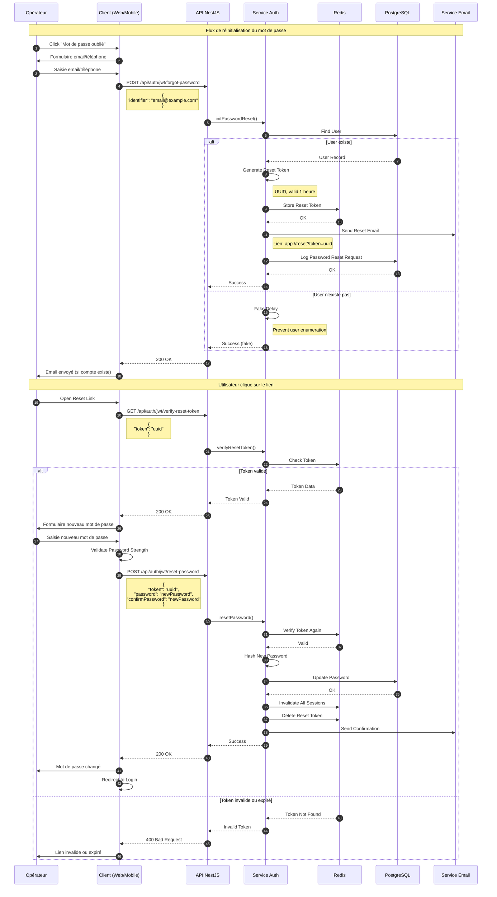
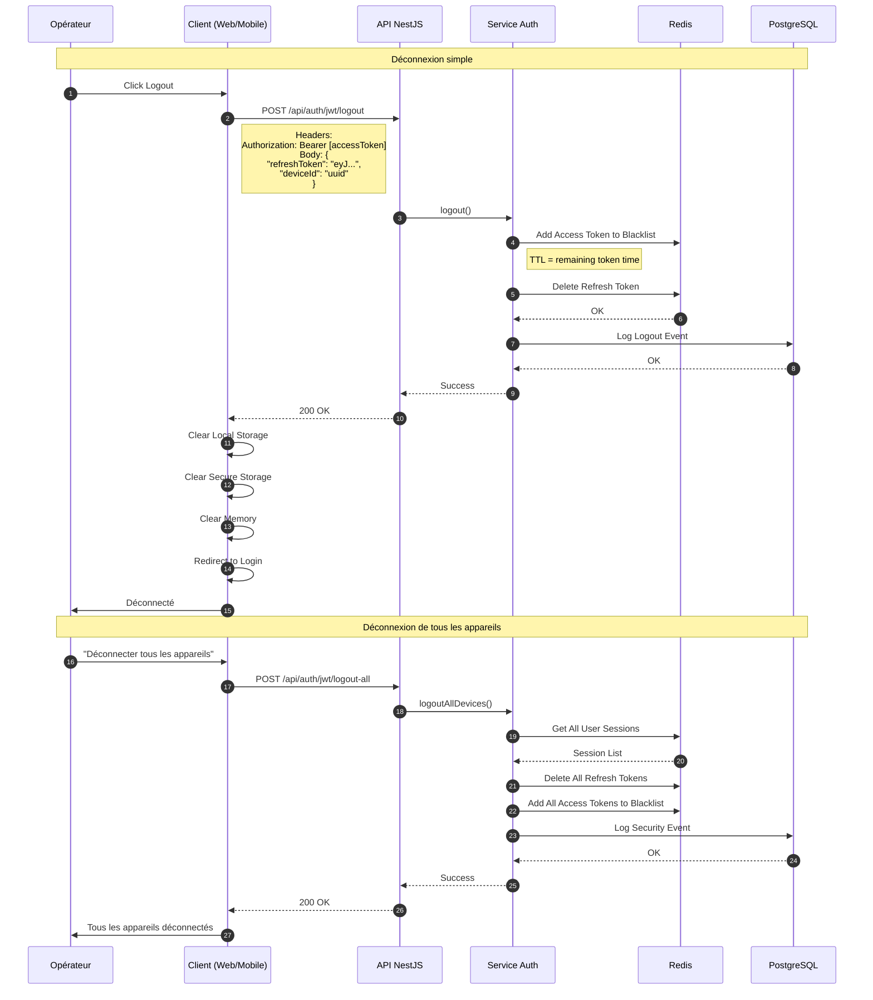

# Diagramme de Séquence - Authentification JWT (Web Terrain & Mobile)

## Vue d'ensemble
L'authentification JWT est utilisée pour les applications Web Terrain et Mobile. Elle permet une authentification stateless avec des tokens portables et une gestion flexible des sessions.

## Diagramme de séquence - Connexion initiale



## Diagramme de séquence - Authentification à deux facteurs (2FA)



## Diagramme de séquence - Rafraîchissement du token



## Diagramme de séquence - Réinitialisation du mot de passe



## Diagramme de séquence - Déconnexion et révocation



## Configuration et structure des tokens

### Structure du JWT Access Token

```json
{
  "header": {
    "alg": "HS256",
    "typ": "JWT"
  },
  "payload": {
    "sub": "550e8400-e29b-41d4-a716-446655440000",
    "email": "operator@example.com",
    "phone": "+33612345678",
    "name": "Jean Dupont",
    "roles": ["OPERATOR", "SUPERVISOR"],
    "permissions": [
      "checklist.fill",
      "checklist.view",
      "data.collect",
      "report.view"
    ],
    "deviceId": "device-uuid",
    "platform": "web|ios|android",
    "iat": 1698765432,
    "exp": 1698766332,
    "iss": "factory-platform",
    "aud": "field-apps",
    "jti": "unique-token-id"
  },
  "signature": "..."
}
```

### Structure du JWT Refresh Token

```json
{
  "header": {
    "alg": "HS256",
    "typ": "JWT"
  },
  "payload": {
    "sub": "550e8400-e29b-41d4-a716-446655440000",
    "tokenFamily": "family-uuid",
    "deviceId": "device-uuid",
    "platform": "web|ios|android",
    "iat": 1698765432,
    "exp": 1699370232,
    "iss": "factory-platform",
    "jti": "refresh-token-id"
  },
  "signature": "..."
}
```

### Configuration de sécurité

```typescript
interface JWTConfig {
  access: {
    secret: process.env.JWT_ACCESS_SECRET,
    expiresIn: '15m',
    algorithm: 'HS256',
  },
  refresh: {
    secret: process.env.JWT_REFRESH_SECRET,
    expiresIn: '7d',
    algorithm: 'HS256',
    rotation: true, // Rotation automatique
  },
  security: {
    maxDevicesPerUser: 5,
    requireDeviceId: true,
    blacklistTTL: 86400, // 24h
    sessionTimeout: 28800, // 8h d'inactivité
  },
  passwordPolicy: {
    minLength: 8,
    requireUppercase: true,
    requireLowercase: true,
    requireNumbers: true,
    requireSpecialChars: true,
    preventReuse: 5, // 5 derniers mots de passe
    maxAge: 90, // Jours
  },
  otp: {
    length: 6,
    ttl: 300, // 5 minutes
    maxAttempts: 3,
    algorithm: 'SHA1',
  },
  rateLimit: {
    login: {
      points: 5,
      duration: 60, // 5 tentatives par minute
    },
    refresh: {
      points: 10,
      duration: 60, // 10 refresh par minute
    },
    passwordReset: {
      points: 3,
      duration: 3600, // 3 par heure
    },
  },
}
```

## Gestion des erreurs

### Codes d'erreur et réponses

| Code | Erreur | Description | Action Client |
|------|--------|-------------|---------------|
| 400 | Bad Request | Données invalides | Vérifier les champs |
| 401 | Unauthorized | Token invalide/expiré | Refresh ou re-login |
| 403 | Forbidden | Permissions insuffisantes | Message d'erreur |
| 423 | Locked | Compte verrouillé | Attendre ou contacter admin |
| 429 | Too Many Requests | Rate limit atteint | Attendre et réessayer |
| 440 | Login Timeout | Session expirée | Re-authentication requise |

### Format des erreurs

```json
{
  "statusCode": 401,
  "error": "Unauthorized",
  "message": "Invalid credentials",
  "details": {
    "code": "AUTH_001",
    "field": "password",
    "attempts": 2,
    "maxAttempts": 5
  },
  "timestamp": "2024-01-15T10:30:00.000Z"
}
```

## Sécurité et bonnes pratiques

### Mesures de sécurité implémentées

1. **Stockage sécurisé des tokens**
   - Web: httpOnly cookies + Secure flag
   - Mobile: Keychain (iOS) / Keystore (Android)
   - Pas de stockage en localStorage (XSS)

2. **Protection contre les attaques**
   - CSRF tokens pour les formulaires
   - Rate limiting sur tous les endpoints
   - Captcha après échecs multiples
   - Détection d'anomalies (géolocalisation)

3. **Chiffrement et hashing**
   - Bcrypt pour les mots de passe (cost: 12)
   - HTTPS obligatoire (TLS 1.3)
   - Secrets rotation régulière

4. **Validation et sanitization**
   - Validation stricte des inputs
   - Échappement des caractères spéciaux
   - Limitation de la taille des requêtes

5. **Monitoring et audit**
   - Logs de toutes les opérations sensibles
   - Alertes temps réel sur comportements suspects
   - Audit trail complet avec timestamp et IP

### Compliance

- **OWASP** Authentication Cheat Sheet
- **RFC 7519** JWT Standard
- **RFC 6749** OAuth 2.0
- **GDPR** pour les données personnelles