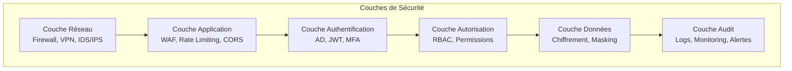
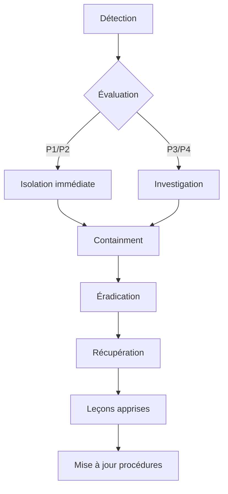

# Guide de Sécurité

## 1. Vue d'ensemble de la Sécurité

### 1.1 Principes de Sécurité
La plateforme suit les principes de sécurité suivants :
- **Defense in Depth** : Plusieurs couches de sécurité
- **Least Privilege** : Accès minimal nécessaire
- **Zero Trust** : Vérification systématique
- **Secure by Design** : Sécurité intégrée dès la conception
- **Compliance First** : Conformité aux standards (GDPR, ISO 27001)

### 1.2 Architecture de Sécurité



## 2. Authentification et Gestion des Identités

### 2.1 Mécanismes d'Authentification

#### Active Directory (Administrateurs)
- **Protocole** : LDAPS (LDAP over SSL)
- **Port** : 636 (sécurisé)
- **Certificat** : Validation obligatoire
- **Binding** : Service Account avec permissions minimales
- **Timeout** : Session de 8 heures maximum

#### JWT (Opérateurs)
- **Algorithme** : RS256 pour access tokens, HS256 pour refresh tokens
- **Durée de vie** : 
  - Access Token : 15 minutes
  - Refresh Token : 7 jours
- **Rotation** : Refresh token rotation activée
- **Stockage** : 
  - Web : httpOnly cookies avec Secure et SameSite flags
  - Mobile : Keychain (iOS) / Keystore (Android)

### 2.2 Authentification Multi-Facteurs (2FA)

```typescript
// Configuration 2FA
{
  methods: ['SMS', 'EMAIL', 'TOTP'],
  otpLength: 6,
  otpValidity: 300, // 5 minutes
  maxAttempts: 3,
  cooldownPeriod: 1800, // 30 minutes après 3 échecs
  backupCodes: {
    count: 10,
    length: 8,
    algorithm: 'random'
  }
}
```

### 2.3 Gestion des Mots de Passe

#### Politique de Mots de Passe
- **Longueur minimale** : 8 caractères
- **Complexité requise** :
  - Au moins 1 majuscule
  - Au moins 1 minuscule
  - Au moins 1 chiffre
  - Au moins 1 caractère spécial
- **Historique** : 5 derniers mots de passe non réutilisables
- **Expiration** : 90 jours
- **Hashing** : Bcrypt avec cost factor de 12

#### Réinitialisation Sécurisée
1. Token unique généré (UUID v4)
2. Validité limitée (1 heure)
3. Usage unique
4. Envoi sur canal vérifié uniquement
5. Validation de l'identité avant changement

## 3. Autorisation et Contrôle d'Accès

### 3.1 Modèle RBAC (Role-Based Access Control)

```yaml
roles:
  ADMIN:
    description: Administrateur système complet
    permissions:
      - '*:*'  # Toutes permissions
  
  MANAGER:
    description: Gestionnaire d'équipe
    permissions:
      - 'checklist:create'
      - 'checklist:update'
      - 'checklist:delete'
      - 'checklist:publish'
      - 'submission:approve'
      - 'dashboard:*'
      - 'report:*'
      - 'user:read'
      - 'user:assign'
  
  SUPERVISOR:
    description: Superviseur terrain
    permissions:
      - 'checklist:read'
      - 'checklist:assign'
      - 'submission:read'
      - 'submission:approve:level1'
      - 'dashboard:read'
      - 'report:read'
  
  OPERATOR:
    description: Opérateur terrain
    permissions:
      - 'checklist:read:assigned'
      - 'submission:create'
      - 'submission:update:own'
      - 'file:upload'
      - 'notification:read:own'
  
  VIEWER:
    description: Consultation uniquement
    permissions:
      - 'dashboard:read:public'
      - 'report:read:public'
```

### 3.2 Attributs de Sécurité Dynamiques

```typescript
// Exemple de contrôle d'accès basé sur attributs
class SecurityContext {
  canAccess(user: User, resource: Resource, action: string): boolean {
    // Vérification RBAC
    if (!user.hasPermission(`${resource.type}:${action}`)) {
      return false;
    }
    
    // Vérifications supplémentaires basées sur attributs
    if (resource.type === 'submission') {
      // Propriétaire peut modifier
      if (action === 'update' && resource.ownerId !== user.id) {
        return false;
      }
      
      // Département doit correspondre
      if (!user.departments.includes(resource.departmentId)) {
        return false;
      }
    }
    
    // Vérification temporelle
    if (resource.validUntil && new Date() > resource.validUntil) {
      return false;
    }
    
    return true;
  }
}
```

## 4. Protection des Données

### 4.1 Chiffrement

#### Chiffrement en Transit
- **TLS Version** : 1.3 minimum (1.2 accepté avec ciphers forts)
- **Cipher Suites** : 
  ```
  TLS_AES_256_GCM_SHA384
  TLS_AES_128_GCM_SHA256
  TLS_CHACHA20_POLY1305_SHA256
  ```
- **HSTS** : Activé avec max-age=31536000
- **Certificate Pinning** : Pour applications mobiles

#### Chiffrement au Repos
- **Base de données** : Transparent Data Encryption (TDE)
- **Fichiers** : AES-256-GCM
- **Backups** : Chiffrement avec clés séparées
- **Clés** : Stockage dans AWS KMS ou HashiCorp Vault

### 4.2 Masquage et Anonymisation

```typescript
// Service de masquage des données
class DataMaskingService {
  maskSensitiveData(data: any, userRole: string): any {
    const rules = this.getMaskingRules(userRole);
    
    return this.applyMasking(data, rules);
  }
  
  private getMaskingRules(role: string): MaskingRule[] {
    const rules: MaskingRule[] = [];
    
    if (role !== 'ADMIN') {
      rules.push(
        { field: 'email', type: 'partial', keepFirst: 3 },
        { field: 'phone', type: 'partial', keepLast: 4 },
        { field: 'salary', type: 'full' },
        { field: 'ssn', type: 'full' }
      );
    }
    
    if (role === 'VIEWER') {
      rules.push(
        { field: 'name', type: 'initials' },
        { field: 'address', type: 'full' }
      );
    }
    
    return rules;
  }
  
  private applyMasking(data: any, rules: MaskingRule[]): any {
    // Implémentation du masquage
    // email: joh***@example.com
    // phone: ***-***-1234
    // etc.
  }
}
```

### 4.3 Protection contre les Injections

#### SQL Injection
- **ORM** : TypeORM avec paramètres liés
- **Validation** : Jamais de concaténation directe
- **Procédures stockées** : Pour opérations sensibles

```typescript
// ❌ JAMAIS
const query = `SELECT * FROM users WHERE email = '${email}'`;

// ✅ TOUJOURS
const user = await this.userRepository
  .createQueryBuilder('user')
  .where('user.email = :email', { email })
  .getOne();
```

#### XSS (Cross-Site Scripting)
- **CSP Header** : Content-Security-Policy strict
- **Sanitization** : DOMPurify pour contenu HTML
- **Encoding** : Échappement automatique des caractères spéciaux

```typescript
// Configuration CSP
app.use(helmet({
  contentSecurityPolicy: {
    directives: {
      defaultSrc: ["'self'"],
      scriptSrc: ["'self'", "'unsafe-inline'"],
      styleSrc: ["'self'", "'unsafe-inline'"],
      imgSrc: ["'self'", "data:", "https:"],
      connectSrc: ["'self'"],
      fontSrc: ["'self'"],
      objectSrc: ["'none'"],
      mediaSrc: ["'self'"],
      frameSrc: ["'none'"],
    },
  },
}));
```

## 5. Sécurité des APIs

### 5.1 Protection contre les Attaques

#### Rate Limiting
```typescript
// Configuration par endpoint
{
  global: {
    windowMs: 60000, // 1 minute
    max: 100 // 100 requêtes par minute
  },
  endpoints: {
    '/auth/login': {
      windowMs: 300000, // 5 minutes
      max: 5 // 5 tentatives par 5 minutes
    },
    '/auth/forgot-password': {
      windowMs: 3600000, // 1 heure
      max: 3 // 3 demandes par heure
    },
    '/api/reports/generate': {
      windowMs: 60000,
      max: 10 // 10 rapports par minute
    }
  }
}
```

#### CORS Configuration
```typescript
// Configuration CORS stricte
app.enableCors({
  origin: (origin, callback) => {
    const allowedOrigins = [
      'https://admin.factory.com',
      'https://field.factory.com',
      'capacitor://localhost', // Mobile
      'http://localhost:3000' // Dev only
    ];
    
    if (!origin || allowedOrigins.includes(origin)) {
      callback(null, true);
    } else {
      callback(new Error('Not allowed by CORS'));
    }
  },
  credentials: true,
  methods: ['GET', 'POST', 'PUT', 'DELETE', 'PATCH'],
  allowedHeaders: ['Content-Type', 'Authorization', 'X-Request-ID'],
  exposedHeaders: ['X-Total-Count', 'X-Page-Count'],
  maxAge: 86400 // 24 heures
});
```

### 5.2 Validation des Entrées

```typescript
// Validation stricte avec class-validator
export class CreateUserDto {
  @IsEmail()
  @IsNotEmpty()
  @MaxLength(100)
  @Transform(({ value }) => value.toLowerCase().trim())
  email: string;

  @IsString()
  @MinLength(8)
  @MaxLength(100)
  @Matches(
    /^(?=.*[a-z])(?=.*[A-Z])(?=.*\d)(?=.*[@$!%*?&])[A-Za-z\d@$!%*?&]/,
    { message: 'Password must meet complexity requirements' }
  )
  password: string;

  @IsPhoneNumber()
  @IsOptional()
  phone?: string;

  @IsString()
  @MinLength(2)
  @MaxLength(50)
  @Matches(/^[a-zA-ZÀ-ÿ\s'-]+$/, {
    message: 'Name contains invalid characters'
  })
  firstName: string;

  @IsUUID('4')
  @IsOptional()
  departmentId?: string;
}
```

## 6. Audit et Monitoring

### 6.1 Logging de Sécurité

#### Événements à Logger
```typescript
enum SecurityEvent {
  // Authentification
  LOGIN_SUCCESS = 'auth.login.success',
  LOGIN_FAILED = 'auth.login.failed',
  LOGOUT = 'auth.logout',
  PASSWORD_CHANGE = 'auth.password.change',
  PASSWORD_RESET = 'auth.password.reset',
  MFA_ENABLED = 'auth.mfa.enabled',
  MFA_DISABLED = 'auth.mfa.disabled',
  
  // Autorisation
  ACCESS_DENIED = 'authz.access.denied',
  PERMISSION_CHANGED = 'authz.permission.changed',
  ROLE_ASSIGNED = 'authz.role.assigned',
  
  // Données
  DATA_ACCESS = 'data.access',
  DATA_MODIFICATION = 'data.modification',
  DATA_DELETION = 'data.deletion',
  DATA_EXPORT = 'data.export',
  
  // Sécurité
  SUSPICIOUS_ACTIVITY = 'security.suspicious',
  BRUTE_FORCE_ATTEMPT = 'security.brute_force',
  SQL_INJECTION_ATTEMPT = 'security.sql_injection',
  XSS_ATTEMPT = 'security.xss',
  CSRF_ATTEMPT = 'security.csrf'
}

// Structure du log de sécurité
interface SecurityLog {
  timestamp: Date;
  event: SecurityEvent;
  userId?: string;
  ip: string;
  userAgent: string;
  resource?: string;
  action?: string;
  result: 'success' | 'failure';
  details?: any;
  severity: 'low' | 'medium' | 'high' | 'critical';
}
```

### 6.2 Détection d'Anomalies

```typescript
// Service de détection d'anomalies
class AnomalyDetectionService {
  private patterns = {
    bruteForce: {
      maxAttempts: 5,
      windowMs: 300000, // 5 minutes
      action: 'BLOCK_IP'
    },
    geoAnomaly: {
      checkRadius: 500, // km
      timeWindow: 3600000, // 1 heure
      action: 'REQUIRE_MFA'
    },
    unusualActivity: {
      normalHours: { start: 6, end: 22 },
      action: 'ALERT_ADMIN'
    }
  };
  
  async detectAnomaly(event: SecurityEvent, context: Context): Promise<Anomaly[]> {
    const anomalies: Anomaly[] = [];
    
    // Détection brute force
    if (event === SecurityEvent.LOGIN_FAILED) {
      const attempts = await this.getRecentAttempts(context.ip);
      if (attempts >= this.patterns.bruteForce.maxAttempts) {
        anomalies.push({
          type: 'BRUTE_FORCE',
          severity: 'high',
          action: this.patterns.bruteForce.action
        });
      }
    }
    
    // Détection anomalie géographique
    if (event === SecurityEvent.LOGIN_SUCCESS) {
      const lastLocation = await this.getLastLoginLocation(context.userId);
      if (lastLocation && this.calculateDistance(lastLocation, context.location) > this.patterns.geoAnomaly.checkRadius) {
        anomalies.push({
          type: 'GEO_ANOMALY',
          severity: 'medium',
          action: this.patterns.geoAnomaly.action
        });
      }
    }
    
    return anomalies;
  }
}
```

## 7. Conformité et Standards

### 7.1 GDPR (Règlement Général sur la Protection des Données)

#### Principes GDPR Implémentés
1. **Lawfulness** : Base légale pour chaque traitement
2. **Transparency** : Information claire sur l'utilisation des données
3. **Purpose Limitation** : Données utilisées uniquement pour l'objectif déclaré
4. **Data Minimization** : Collecte minimale nécessaire
5. **Accuracy** : Données maintenues à jour
6. **Storage Limitation** : Durée de conservation définie
7. **Security** : Mesures techniques et organisationnelles

#### Droits des Utilisateurs
```typescript
// API pour les droits GDPR
class GDPRController {
  @Get('/my-data')
  @UseGuards(JwtAuthGuard)
  async getMyData(@User() user): Promise<UserData> {
    // Droit d'accès
    return this.gdprService.exportUserData(user.id);
  }
  
  @Put('/my-data')
  @UseGuards(JwtAuthGuard)
  async updateMyData(@User() user, @Body() data): Promise<void> {
    // Droit de rectification
    return this.gdprService.updateUserData(user.id, data);
  }
  
  @Delete('/my-data')
  @UseGuards(JwtAuthGuard)
  async deleteMyData(@User() user): Promise<void> {
    // Droit à l'effacement
    return this.gdprService.deleteUserData(user.id);
  }
  
  @Post('/data-portability')
  @UseGuards(JwtAuthGuard)
  async exportMyData(@User() user): Promise<{ url: string }> {
    // Droit à la portabilité
    return this.gdprService.generateDataExport(user.id);
  }
  
  @Post('/consent')
  @UseGuards(JwtAuthGuard)
  async updateConsent(@User() user, @Body() consent): Promise<void> {
    // Gestion du consentement
    return this.gdprService.updateConsent(user.id, consent);
  }
}
```

### 7.2 Standards de Sécurité

#### OWASP Top 10 - Mesures Implémentées

| Risque | Mesures |
|--------|---------|
| A01: Broken Access Control | RBAC strict, validation des permissions à chaque requête |
| A02: Cryptographic Failures | TLS 1.3, chiffrement AES-256, gestion sécurisée des clés |
| A03: Injection | Requêtes paramétrées, validation stricte, sanitization |
| A04: Insecure Design | Threat modeling, security by design, code reviews |
| A05: Security Misconfiguration | Configuration durcie, secrets externalisés, headers sécurité |
| A06: Vulnerable Components | Dépendances à jour, scan régulier, SBOM |
| A07: Authentication Failures | MFA, rate limiting, session sécurisée |
| A08: Data Integrity Failures | Validation de l'intégrité, signature des données critiques |
| A09: Security Logging Failures | Logs centralisés, monitoring temps réel, alertes |
| A10: SSRF | Validation des URLs, whitelist, isolation réseau |

## 8. Plan de Réponse aux Incidents

### 8.1 Classification des Incidents

| Niveau | Description | Temps de Réponse | Escalade |
|--------|-------------|------------------|----------|
| P1 - Critique | Fuite de données, intrusion système | < 15 minutes | CTO + CISO + Legal |
| P2 - Élevé | Tentative d'intrusion, DoS | < 1 heure | Security Team Lead |
| P3 - Moyen | Anomalies détectées, vulnérabilité | < 4 heures | Security Engineer |
| P4 - Bas | Faux positif, scan automatisé | < 24 heures | SOC Analyst |

### 8.2 Procédure de Réponse



### 8.3 Checklist d'Incident

```markdown
## Incident Response Checklist

### Phase 1: Détection et Analyse (0-30 min)
- [ ] Identifier la nature de l'incident
- [ ] Documenter l'heure de détection
- [ ] Collecter les logs initiaux
- [ ] Évaluer l'impact potentiel
- [ ] Classifier le niveau de sévérité
- [ ] Notifier l'équipe de réponse

### Phase 2: Containment (30 min - 2h)
- [ ] Isoler les systèmes affectés
- [ ] Préserver les preuves
- [ ] Bloquer les accès malveillants
- [ ] Désactiver les comptes compromis
- [ ] Appliquer les patches d'urgence

### Phase 3: Éradication (2h - 24h)
- [ ] Identifier la cause racine
- [ ] Supprimer les malwares/backdoors
- [ ] Corriger les vulnérabilités
- [ ] Renforcer la sécurité
- [ ] Vérifier l'absence de persistence

### Phase 4: Récupération (24h - 7j)
- [ ] Restaurer les services
- [ ] Monitoring renforcé
- [ ] Vérification de l'intégrité
- [ ] Tests de sécurité
- [ ] Communication aux utilisateurs

### Phase 5: Post-Incident (7j - 30j)
- [ ] Rapport d'incident complet
- [ ] Analyse des leçons apprises
- [ ] Mise à jour des procédures
- [ ] Formation de l'équipe
- [ ] Amélioration des contrôles
```

## 9. Tests de Sécurité

### 9.1 Programme de Tests

| Type de Test | Fréquence | Scope | Responsable |
|--------------|-----------|-------|-------------|
| Scan de vulnérabilités | Hebdomadaire | Infrastructure + App | DevSecOps |
| Test d'intrusion | Trimestriel | Application complète | Externe |
| Audit de code | À chaque PR | Code source | Dev Team |
| Scan de dépendances | Quotidien | Libraries | CI/CD |
| Test de charge | Mensuel | API + DB | QA Team |
| Simulation de phishing | Trimestriel | Employés | Security Team |
| DR Test | Semestriel | Infrastructure | Ops Team |

### 9.2 Outils de Sécurité

```yaml
security_tools:
  sast: # Static Application Security Testing
    - SonarQube
    - Checkmarx
    - Semgrep
  
  dast: # Dynamic Application Security Testing
    - OWASP ZAP
    - Burp Suite
    - Acunetix
  
  dependency_scanning:
    - Snyk
    - OWASP Dependency Check
    - npm audit
  
  infrastructure:
    - Nessus
    - OpenVAS
    - Qualys
  
  monitoring:
    - Splunk
    - ELK Stack
    - Datadog
  
  secrets_management:
    - HashiCorp Vault
    - AWS Secrets Manager
    - Azure Key Vault
```

## 10. Formation et Sensibilisation

### 10.1 Programme de Formation

#### Formation Développeurs
- Secure coding practices (OWASP)
- Gestion sécurisée des secrets
- Tests de sécurité
- Revue de code sécurité
- Incident response

#### Formation Utilisateurs
- Phishing et ingénierie sociale
- Mots de passe sécurisés
- Protection des données
- Signalement d'incidents
- Utilisation sécurisée des outils

### 10.2 Métriques de Sécurité

```typescript
// KPI de Sécurité
interface SecurityMetrics {
  // Vulnérabilités
  vulnerabilities: {
    critical: number;
    high: number;
    medium: number;
    low: number;
    mttr: number; // Mean Time To Remediate
  };
  
  // Incidents
  incidents: {
    total: number;
    resolved: number;
    mttr: number; // Mean Time To Resolve
    falsePosives: number;
  };
  
  // Conformité
  compliance: {
    coveragePercent: number;
    auditsPass: number;
    auditsTotal: number;
  };
  
  // Formation
  training: {
    completionRate: number;
    phishingTestFailure: number;
  };
  
  // Disponibilité
  availability: {
    uptime: number;
    securityIncidentDowntime: number;
  };
}
```

## 11. Contacts d'Urgence

### Équipe de Sécurité

| Rôle | Contact | Disponibilité |
|------|---------|---------------|
| CISO | security@company.com | 24/7 |
| Security Team Lead | security-team@company.com | 24/7 |
| SOC | soc@company.com | 24/7 |
| Incident Response | incident@company.com | 24/7 |
| DPO (GDPR) | dpo@company.com | Heures bureau |

### Contacts Externes

| Service | Contact | Usage |
|---------|---------|-------|
| CERT National | cert@cert.fr | Incidents majeurs |
| Police Cyber | cybermenaces@interieur.gouv.fr | Plaintes |
| CNIL | notifications@cnil.fr | Violations GDPR |
| Assurance Cyber | cyber@insurance.com | Déclaration sinistre |